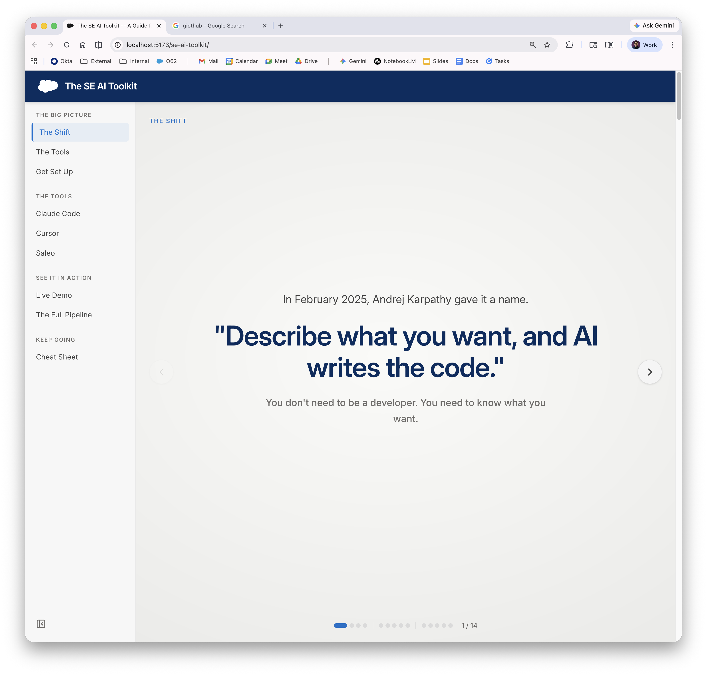

# Coding with AI -- A Guide for Salesforce SEs

A practical guide to vibe coding with Claude Code. No prior programming experience required.



## What You'll Learn

- **What vibe coding actually is** -- and why it matters for SEs
- **How to get started** -- installing Claude Code and setting up your first project
- **How to think about prompts** -- the difference between good and great instructions
- **How to stay safe** -- version control, cost management, and avoiding common mistakes
- **What works and what doesn't** -- real patterns from the field

## How to Access

The guide is hosted at **[your-vercel-url]**. Just open the link -- nothing to install.

## Want to Run It Locally?

If you'd like to run the site on your own machine:

```bash
npm install
npm run dev
```

Then open [http://localhost:5173](http://localhost:5173) in your browser.

## Built With

React, Tailwind CSS, and shadcn/ui. Hosted on Vercel.
